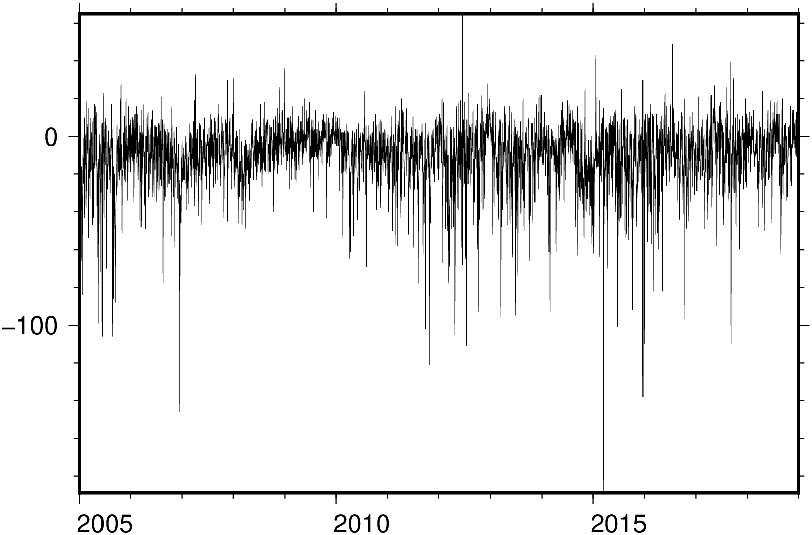
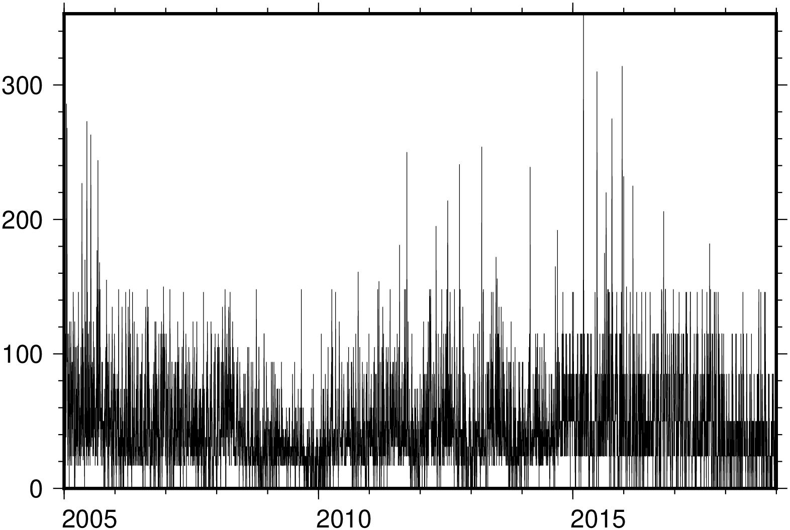
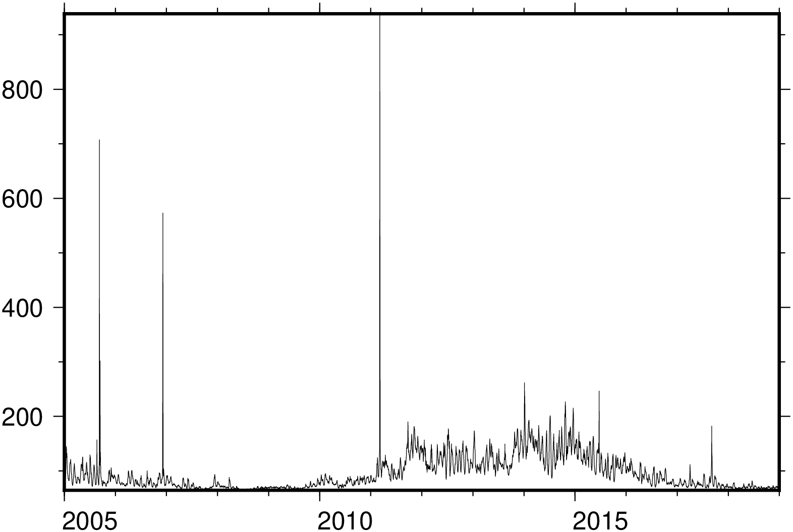
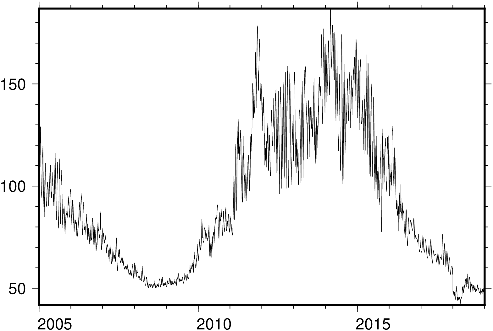
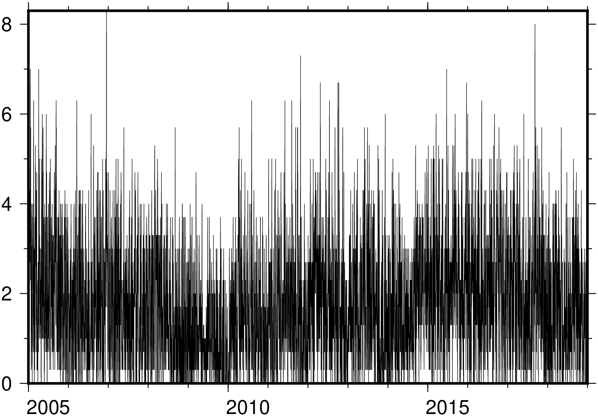

# HTsi

# space indices

Only a test package, mostly based on
[SatelliteToolbox.jl](https://github.com/JuliaSpace/SatelliteToolbox.jl)
(please check it first).

The main difference is that this package also support Dst index.

## Dst

## dtc

## flux

## solfsym

## Kp

